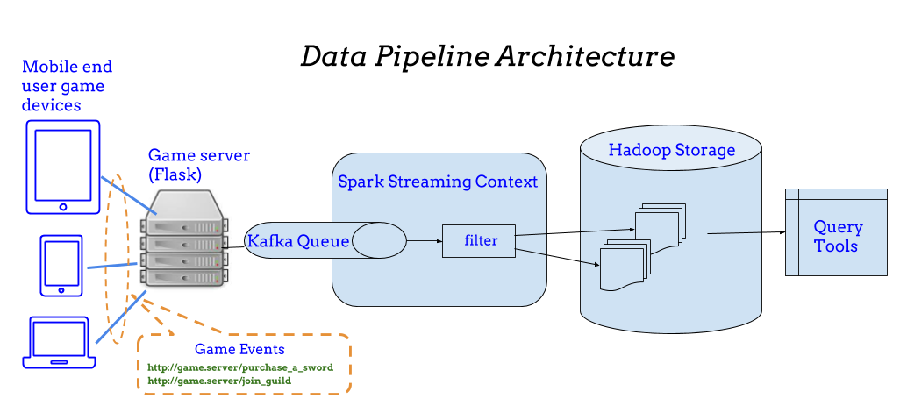

# Tracking Mobile Game Events

*By Guangyu (Gary) Pei*

## Executive summary

In this project, a docker cluster is created to demonstrate how mobile game events
are captured by `flask` web server; how these events are then published to the `Kafka` topic queue;
and how `spark` ingests the message, filters and saves the data to Hadoop and makes queries on the data.

## Introduction

As a data scientist at a game development company, my objective of this project is
to design and demonstrate the end-to-end data pipeline for tracking two mobile game events.
The events of interests are `purchase a sword` and `join guild`.
The mobile game players generate these events through web interface.

To achieve this goal, the data pipeline was implemented. The approach
of building the pipeline is to start with user Web API interfaces and then follow the data
pipeline path. Many off-the-shelf containers are used for the data pipeline implementation.
Off-the-shelf containers `Kafka` and `Zookeeper` are used as part of
speed layer. The game web server `flask` runs inside the customized container `mids`, which
is provided by our instructors. `spark` container is also a customized container provided
by our instructors.

For this project, the task is to demonstrate the entire data pipeline. The web server API
is used to log `purchase a sword` and `join guild` events as `json` messages and publish these
events to `Kafka` message queue so that later part of data pipeline modules can subscribe
for these events. The `spark` container is deployed to process the game events and save them
on Hadoop file system. `spark` is also used to perform queries from the saved data.

There are six files associated with this project:

   - This file is the writeup with step-by-step command annotations.
   - [docker-compose.yml](docker-compose.yml) is the docker cluster configuration file.
   - [game_api.py](game_api.py) is the Python API for the Web Server.
   - [separate_events.py](separate_events.py) is the Python `spark` scripts to separate game event messages.
   - [just_filtering.py](just_filtering.py) is the Python `spark` scripts to filter game event messages.
   - [filtered_writes.py](filtered_writes.py) is the Python `spark` scripts to save game event messages to file after filtering.
   - [prj3query.ipynb](prj3query.ipynb) is the Jupyter Notebook to save demonstrate queries from saved data.

## Architecure



The data pipeline architecture is illustrated in above figure. It follows the Lambda Architecture.
The data sources are from mobile game players. When game server responds to
game events `purchase_a_sword` and `join_guild`, it also publishes the events using `Kafka` as speed
layer in the Lambda Architecture. The `Spark` streaming context will subscribe the `Kafka` on the
game events channel and perform message ingestion functions and store the data on `Hadoop` file system.
`Hadoop` is the batch layer in the Lambda Architecture. The data scientists can use various
query tools to perform data analytics.

## Implementation and Demonstration

##### Step 1: Make project directory and create docker-compose.yml file

First, I created a directory named `w205/prj3` and copied `docker-compose.yml` used in synchronous session 12.

The `docker-compose.yml` reflects the docker containers as following.
The `mids` container exposes port `5000`, which will be used for game events Web API.
Zookeeper listens on port number `32181`, which Kafka
uses to connect to Zookeeper. Kafka listens on port number `29092` for data streaming.
`spark` uses port `8888` which enables `jupyter` notebook web access.
All containers are connected via internal Linux bridge on private network `172.18.0.0/16` (which
is the default setting for the docker cluster).

>mkdir -p w205/prj3

>cd w205/prj3

>cp ../full-stack/docker-compose.yml .

>cat docker-compose.yml

```console
science@w205s7-crook-13:~/w205/prj3$ cat docker-compose.yml
---
version: '2'
services:
  zookeeper:
    image: confluentinc/cp-zookeeper:latest
    environment:
      ZOOKEEPER_CLIENT_PORT: 32181
      ZOOKEEPER_TICK_TIME: 2000
    expose:
      - "2181"
      - "2888"
      - "32181"
      - "3888"
    extra_hosts:
      - "moby:127.0.0.1"

  kafka:
    image: confluentinc/cp-kafka:latest
    depends_on:
      - zookeeper
    environment:
      KAFKA_BROKER_ID: 1
      KAFKA_ZOOKEEPER_CONNECT: zookeeper:32181
      KAFKA_ADVERTISED_LISTENERS: PLAINTEXT://kafka:29092
      KAFKA_OFFSETS_TOPIC_REPLICATION_FACTOR: 1
    expose:
      - "9092"
      - "29092"
    extra_hosts:
      - "moby:127.0.0.1"

  cloudera:
    image: midsw205/cdh-minimal:latest
    expose:
      - "8020" # nn
      - "50070" # nn http
      - "8888" # hue
    #ports:
    #- "8888:8888"
    extra_hosts:
      - "moby:127.0.0.1"

  spark:
    image: midsw205/spark-python:0.0.5
    stdin_open: true
    tty: true
    volumes:
      - /home/science/w205:/w205
    expose:
      - "8888"
    ports:
      - "8888:8888"
    depends_on:
      - cloudera
    environment:
      HADOOP_NAMENODE: cloudera
    extra_hosts:
      - "moby:127.0.0.1"
    command: bash

  mids:
    image: midsw205/base:0.1.9
    stdin_open: true
    tty: true
    volumes:
      - /home/science/w205:/w205
    expose:
      - "5000"
    ports:
      - "5000:5000"
    extra_hosts:
      - "moby:127.0.0.1"
```


##### Step 2: Spin up the docker container cluster

The docker containers included in the cluster are `kafka`, `zookeeper`, `saprk` and `mids`.
I spin up the docker cluster with command `docker-compose up -d` as shown below.
The port numbers reported by `docker-compose ps` matches with configuration
in the `docker-compose.yml` file.

> docker-compose up -d

```console
science@w205s7-crook-13:~/w205/prj3$ docker-compose up -d
Creating network "prj3_default" with the default driver
Creating prj3_zookeeper_1
Creating prj3_mids_1
Creating prj3_cloudera_1
Creating prj3_kafka_1
Creating prj3_spark_1
science@w205s7-crook-13:~/w205/prj3$ docker-compose ps
      Name                  Command            State                                         Ports
-----------------------------------------------------------------------------------------------------------------------------------------
prj3_cloudera_1    cdh_startup_script.sh       Up      11000/tcp, 11443/tcp, 19888/tcp, 50070/tcp, 8020/tcp, 8088/tcp, 8888/tcp, 9090/tcp
prj3_kafka_1       /etc/confluent/docker/run   Up      29092/tcp, 9092/tcp
prj3_mids_1        /bin/bash                   Up      0.0.0.0:5000->5000/tcp, 8888/tcp
prj3_spark_1       docker-entrypoint.sh bash   Up      0.0.0.0:8888->8888/tcp
prj3_zookeeper_1   /etc/confluent/docker/run   Up      2181/tcp, 2888/tcp, 32181/tcp, 3888/tcp
```

##### Step 3: Monitor logs of `hadoop` and `kafka`, check the initial `hdfs`

I used the two terminals to monitor the logs of `hadoop` and `kafka` continuously with the
the following commands.

```console
docker-compose logs -f cloudera
docker-compose logs -f kafka
```

I also check the initial status of `hdfs` and the following is the output.

```console
science@w205s7-crook-13:~/w205/prj3$ docker-compose exec cloudera hadoop fs -ls /tmp/
Found 2 items
drwxrwxrwt   - mapred mapred              0 2018-02-06 18:27 /tmp/hadoop-yarn
drwx-wx-wx   - root   supergroup          0 2018-07-21 16:09 /tmp/hive
```

##### Step 4: Create `events` topic on `kafka`

In the following, `Kafka` topic queue namded `events` was created.

```console
science@w205s7-crook-13:~/w205/prj3$ docker-compose exec kafka \
>    kafka-topics \
>      --create \
>      --topic events \
>      --partitions 1 \
>      --replication-factor 1 \
>      --if-not-exists \
>      --zookeeper zookeeper:32181
Created topic "events".
```

##### Step 5: Create Web server API `game_api.py`

I created `game_api.py` file, which contains the following Python code.
Essentially, two simple Web API calls, namely `purchase_a_sword` and `join_guild`, were
implemented. Both use the json to log the events to `kafka`. Moreover, meta
data from user request was also added to the event logging. Finally,
I enhanced the API to allow parameters in `purchase_a_sword` Web API.

```python
#!/usr/bin/env python
import json
from kafka import KafkaProducer
from flask import Flask, request
app = Flask(__name__)
event_logger = KafkaProducer(bootstrap_servers='kafka:29092')
events_topic = 'events'

def log_to_kafka(topic, event):
    event.update(request.headers)
    event_logger.send(topic, json.dumps(event).encode())

@app.route("/purchase_a_sword")
def purchase_sword():
    purchase_sword_event = {'event_type': 'purchase_sword'}
    sword_params = request.args.to_dict()
    purchase_sword_event.update(sword_params)
    log_to_kafka(events_topic, purchase_sword_event)
    return "\nSword Purchased!\n"

@app.route("/join_guild")
def join_guild():
    joined_guild_event = {'event_type': 'join_guild'}
    log_to_kafka(events_topic, joined_guild_event)
    return "\nGuild joined!\n"
```

##### Step 6: Run `flask` with `game_api.py` and generate game events

I use the following command to launch `flask` web server listening on port `5000` from any
hosts, namely, `0.0.0.0`.

> docker-compose exec mids env FLASK_APP=/w205/prj3/game_api.py flask run --host 0.0.0.0

```console
science@w205s7-crook-13:~/w205/prj3$ docker-compose exec mids env FLASK_APP=/w205/prj3/game_api.py flask run --host 0.0.0.0
 * Serving Flask app "game_api"
 * Running on http://0.0.0.0:5000/ (Press CTRL+C to quit)
127.0.0.1 - - [26/Jul/2018 22:36:27] "GET /purchase_a_sword HTTP/1.0" 200 -
127.0.0.1 - - [26/Jul/2018 22:36:27] "GET /purchase_a_sword HTTP/1.0" 200 -
127.0.0.1 - - [26/Jul/2018 22:36:27] "GET /purchase_a_sword HTTP/1.0" 200 -
127.0.0.1 - - [26/Jul/2018 22:36:27] "GET /purchase_a_sword HTTP/1.0" 200 -
127.0.0.1 - - [26/Jul/2018 22:36:27] "GET /purchase_a_sword HTTP/1.0" 200 -
127.0.0.1 - - [26/Jul/2018 22:36:27] "GET /purchase_a_sword HTTP/1.0" 200 -
127.0.0.1 - - [26/Jul/2018 22:36:27] "GET /purchase_a_sword HTTP/1.0" 200 -
127.0.0.1 - - [26/Jul/2018 22:36:27] "GET /purchase_a_sword HTTP/1.0" 200 -
127.0.0.1 - - [26/Jul/2018 22:36:27] "GET /purchase_a_sword HTTP/1.0" 200 -
127.0.0.1 - - [26/Jul/2018 22:36:27] "GET /purchase_a_sword HTTP/1.0" 200 -
127.0.0.1 - - [26/Jul/2018 22:37:32] "GET /join_guild HTTP/1.0" 200 -
127.0.0.1 - - [26/Jul/2018 22:37:32] "GET /join_guild HTTP/1.0" 200 -
127.0.0.1 - - [26/Jul/2018 22:37:32] "GET /join_guild HTTP/1.0" 200 -
127.0.0.1 - - [26/Jul/2018 22:37:32] "GET /join_guild HTTP/1.0" 200 -
127.0.0.1 - - [26/Jul/2018 22:37:32] "GET /join_guild HTTP/1.0" 200 -
127.0.0.1 - - [26/Jul/2018 22:37:32] "GET /join_guild HTTP/1.0" 200 -
127.0.0.1 - - [26/Jul/2018 22:37:32] "GET /join_guild HTTP/1.0" 200 -
127.0.0.1 - - [26/Jul/2018 22:37:32] "GET /join_guild HTTP/1.0" 200 -
127.0.0.1 - - [26/Jul/2018 22:37:32] "GET /join_guild HTTP/1.0" 200 -
127.0.0.1 - - [26/Jul/2018 22:37:32] "GET /join_guild HTTP/1.0" 200 -
127.0.0.1 - - [26/Jul/2018 22:38:24] "GET /purchase_a_sword HTTP/1.0" 200 -
127.0.0.1 - - [26/Jul/2018 22:38:25] "GET /purchase_a_sword HTTP/1.0" 200 -
127.0.0.1 - - [26/Jul/2018 22:38:25] "GET /purchase_a_sword HTTP/1.0" 200 -
127.0.0.1 - - [26/Jul/2018 22:38:25] "GET /purchase_a_sword HTTP/1.0" 200 -
127.0.0.1 - - [26/Jul/2018 22:38:25] "GET /purchase_a_sword HTTP/1.0" 200 -
127.0.0.1 - - [26/Jul/2018 22:38:25] "GET /purchase_a_sword HTTP/1.0" 200 -
127.0.0.1 - - [26/Jul/2018 22:38:25] "GET /purchase_a_sword HTTP/1.0" 200 -
127.0.0.1 - - [26/Jul/2018 22:38:25] "GET /purchase_a_sword HTTP/1.0" 200 -
127.0.0.1 - - [26/Jul/2018 22:38:25] "GET /purchase_a_sword HTTP/1.0" 200 -
127.0.0.1 - - [26/Jul/2018 22:38:25] "GET /purchase_a_sword HTTP/1.0" 200 -
127.0.0.1 - - [26/Jul/2018 22:39:13] "GET /join_guild HTTP/1.0" 200 -
127.0.0.1 - - [26/Jul/2018 22:39:13] "GET /join_guild HTTP/1.0" 200 -
127.0.0.1 - - [26/Jul/2018 22:39:13] "GET /join_guild HTTP/1.0" 200 -
127.0.0.1 - - [26/Jul/2018 22:39:13] "GET /join_guild HTTP/1.0" 200 -
127.0.0.1 - - [26/Jul/2018 22:39:13] "GET /join_guild HTTP/1.0" 200 -
127.0.0.1 - - [26/Jul/2018 22:39:13] "GET /join_guild HTTP/1.0" 200 -
127.0.0.1 - - [26/Jul/2018 22:39:13] "GET /join_guild HTTP/1.0" 200 -
127.0.0.1 - - [26/Jul/2018 22:39:13] "GET /join_guild HTTP/1.0" 200 -
127.0.0.1 - - [26/Jul/2018 22:39:13] "GET /join_guild HTTP/1.0" 200 -
127.0.0.1 - - [26/Jul/2018 22:39:13] "GET /join_guild HTTP/1.0" 200 -
```

With a different terminal, I use the Apache bench commands to generate Web API `purchase_a_sword` and `join_guild` calls.
Note that the output from the `flask` server matches with Apache bench commands.

```console
science@w205s7-crook-13:~/w205/prj3$ docker-compose exec mids ab -n 10 -H "Host: user1.comcast.com" http://localhost:5000/purchase_a_sword
This is ApacheBench, Version 2.3 <$Revision: 1706008 $>
Copyright 1996 Adam Twiss, Zeus Technology Ltd, http://www.zeustech.net/
Licensed to The Apache Software Foundation, http://www.apache.org/

Benchmarking localhost (be patient).....done


Server Software:        Werkzeug/0.14.1
Server Hostname:        localhost
Server Port:            5000

Document Path:          /purchase_a_sword
Document Length:        18 bytes

Concurrency Level:      1
Time taken for tests:   0.028 seconds
Complete requests:      10
Failed requests:        0
Total transferred:      1730 bytes
HTML transferred:       180 bytes
Requests per second:    362.31 [#/sec] (mean)
Time per request:       2.760 [ms] (mean)
Time per request:       2.760 [ms] (mean, across all concurrent requests)
Transfer rate:          61.21 [Kbytes/sec] received

Connection Times (ms)
              min  mean[+/-sd] median   max
Connect:        0    0   0.1      0       0
Processing:     1    3   3.6      2      13
Waiting:        0    2   3.8      1      12
Total:          1    3   3.6      2      13

Percentage of the requests served within a certain time (ms)
  50%      2
  66%      2
  75%      2
  80%      2
  90%     13
  95%     13
  98%     13
  99%     13
 100%     13 (longest request)
science@w205s7-crook-13:~/w205/prj3$ docker-compose exec mids ab -n 10 -H "Host: user1.comcast.com" http://localhost:5000/join_guild
This is ApacheBench, Version 2.3 <$Revision: 1706008 $>
Copyright 1996 Adam Twiss, Zeus Technology Ltd, http://www.zeustech.net/
Licensed to The Apache Software Foundation, http://www.apache.org/

Benchmarking localhost (be patient).....done


Server Software:        Werkzeug/0.14.1
Server Hostname:        localhost
Server Port:            5000

Document Path:          /join_guild
Document Length:        15 bytes

Concurrency Level:      1
Time taken for tests:   0.049 seconds
Complete requests:      10
Failed requests:        0
Total transferred:      1700 bytes
HTML transferred:       150 bytes
Requests per second:    206.04 [#/sec] (mean)
Time per request:       4.854 [ms] (mean)
Time per request:       4.854 [ms] (mean, across all concurrent requests)
Transfer rate:          34.21 [Kbytes/sec] received

Connection Times (ms)
              min  mean[+/-sd] median   max
Connect:        0    0   0.3      0       1
Processing:     2    5   2.6      5      10
Waiting:        0    4   3.2      4      10
Total:          2    5   2.5      5      10

Percentage of the requests served within a certain time (ms)
  50%      5
  66%      5
  75%      6
  80%      8
  90%     10
  95%     10
  98%     10
  99%     10
 100%     10 (longest request)
science@w205s7-crook-13:~/w205/prj3$ docker-compose exec mids ab -n 10 -H "Host: user2.att.com" http://localhost:5000/purchase_a_sword
This is ApacheBench, Version 2.3 <$Revision: 1706008 $>
Copyright 1996 Adam Twiss, Zeus Technology Ltd, http://www.zeustech.net/
Licensed to The Apache Software Foundation, http://www.apache.org/

Benchmarking localhost (be patient).....done


Server Software:        Werkzeug/0.14.1
Server Hostname:        localhost
Server Port:            5000

Document Path:          /purchase_a_sword
Document Length:        18 bytes

Concurrency Level:      1
Time taken for tests:   0.045 seconds
Complete requests:      10
Failed requests:        0
Total transferred:      1730 bytes
HTML transferred:       180 bytes
Requests per second:    222.90 [#/sec] (mean)
Time per request:       4.486 [ms] (mean)
Time per request:       4.486 [ms] (mean, across all concurrent requests)
Transfer rate:          37.66 [Kbytes/sec] received

Connection Times (ms)
              min  mean[+/-sd] median   max
Connect:        0    0   0.0      0       0
Processing:     2    4   3.5      4      11
Waiting:        1    4   3.6      2      11
Total:          2    4   3.5      4      11

Percentage of the requests served within a certain time (ms)
  50%      4
  66%      4
  75%      6
  80%     10
  90%     11
  95%     11
  98%     11
  99%     11
 100%     11 (longest request)
science@w205s7-crook-13:~/w205/prj3$ docker-compose exec mids ab -n 10 -H "Host: user2.att.com" http://localhost:5000/join_guild
This is ApacheBench, Version 2.3 <$Revision: 1706008 $>
Copyright 1996 Adam Twiss, Zeus Technology Ltd, http://www.zeustech.net/
Licensed to The Apache Software Foundation, http://www.apache.org/

Benchmarking localhost (be patient).....done


Server Software:        Werkzeug/0.14.1
Server Hostname:        localhost
Server Port:            5000

Document Path:          /join_guild
Document Length:        15 bytes

Concurrency Level:      1
Time taken for tests:   0.056 seconds
Complete requests:      10
Failed requests:        0
Total transferred:      1700 bytes
HTML transferred:       150 bytes
Requests per second:    177.58 [#/sec] (mean)
Time per request:       5.631 [ms] (mean)
Time per request:       5.631 [ms] (mean, across all concurrent requests)
Transfer rate:          29.48 [Kbytes/sec] received

Connection Times (ms)
              min  mean[+/-sd] median   max
Connect:        0    0   0.1      0       0
Processing:     3    6   2.7      6      10
Waiting:        0    3   2.1      3       6
Total:          3    6   2.7      6      11

Percentage of the requests served within a certain time (ms)
  50%      6
  66%      6
  75%      7
  80%      9
  90%     11
  95%     11
  98%     11
  99%     11
 100%     11 (longest request)
```

Also, I used a third terminal with `kafkacat` command to monitor the messages published into `kafka` as
shown below.

```console
science@w205s7-crook-13:~/w205/prj3$ docker-compose exec mids kafkacat -C -b kafka:29092 -t events -o beginning
{"Host": "user1.comcast.com", "event_type": "purchase_sword", "Accept": "*/*", "User-Agent": "ApacheBench/2.3"}
{"Host": "user1.comcast.com", "event_type": "purchase_sword", "Accept": "*/*", "User-Agent": "ApacheBench/2.3"}
{"Host": "user1.comcast.com", "event_type": "purchase_sword", "Accept": "*/*", "User-Agent": "ApacheBench/2.3"}
{"Host": "user1.comcast.com", "event_type": "purchase_sword", "Accept": "*/*", "User-Agent": "ApacheBench/2.3"}
{"Host": "user1.comcast.com", "event_type": "purchase_sword", "Accept": "*/*", "User-Agent": "ApacheBench/2.3"}
{"Host": "user1.comcast.com", "event_type": "purchase_sword", "Accept": "*/*", "User-Agent": "ApacheBench/2.3"}
{"Host": "user1.comcast.com", "event_type": "purchase_sword", "Accept": "*/*", "User-Agent": "ApacheBench/2.3"}
{"Host": "user1.comcast.com", "event_type": "purchase_sword", "Accept": "*/*", "User-Agent": "ApacheBench/2.3"}
{"Host": "user1.comcast.com", "event_type": "purchase_sword", "Accept": "*/*", "User-Agent": "ApacheBench/2.3"}
{"Host": "user1.comcast.com", "event_type": "purchase_sword", "Accept": "*/*", "User-Agent": "ApacheBench/2.3"}
{"Host": "user1.comcast.com", "event_type": "join_guild", "Accept": "*/*", "User-Agent": "ApacheBench/2.3"}
{"Host": "user1.comcast.com", "event_type": "join_guild", "Accept": "*/*", "User-Agent": "ApacheBench/2.3"}
{"Host": "user1.comcast.com", "event_type": "join_guild", "Accept": "*/*", "User-Agent": "ApacheBench/2.3"}
{"Host": "user1.comcast.com", "event_type": "join_guild", "Accept": "*/*", "User-Agent": "ApacheBench/2.3"}
{"Host": "user1.comcast.com", "event_type": "join_guild", "Accept": "*/*", "User-Agent": "ApacheBench/2.3"}
{"Host": "user1.comcast.com", "event_type": "join_guild", "Accept": "*/*", "User-Agent": "ApacheBench/2.3"}
{"Host": "user1.comcast.com", "event_type": "join_guild", "Accept": "*/*", "User-Agent": "ApacheBench/2.3"}
{"Host": "user1.comcast.com", "event_type": "join_guild", "Accept": "*/*", "User-Agent": "ApacheBench/2.3"}
{"Host": "user1.comcast.com", "event_type": "join_guild", "Accept": "*/*", "User-Agent": "ApacheBench/2.3"}
{"Host": "user1.comcast.com", "event_type": "join_guild", "Accept": "*/*", "User-Agent": "ApacheBench/2.3"}
{"Host": "user2.att.com", "event_type": "purchase_sword", "Accept": "*/*", "User-Agent": "ApacheBench/2.3"}
{"Host": "user2.att.com", "event_type": "purchase_sword", "Accept": "*/*", "User-Agent": "ApacheBench/2.3"}
{"Host": "user2.att.com", "event_type": "purchase_sword", "Accept": "*/*", "User-Agent": "ApacheBench/2.3"}
{"Host": "user2.att.com", "event_type": "purchase_sword", "Accept": "*/*", "User-Agent": "ApacheBench/2.3"}
{"Host": "user2.att.com", "event_type": "purchase_sword", "Accept": "*/*", "User-Agent": "ApacheBench/2.3"}
{"Host": "user2.att.com", "event_type": "purchase_sword", "Accept": "*/*", "User-Agent": "ApacheBench/2.3"}
{"Host": "user2.att.com", "event_type": "purchase_sword", "Accept": "*/*", "User-Agent": "ApacheBench/2.3"}
{"Host": "user2.att.com", "event_type": "purchase_sword", "Accept": "*/*", "User-Agent": "ApacheBench/2.3"}
{"Host": "user2.att.com", "event_type": "purchase_sword", "Accept": "*/*", "User-Agent": "ApacheBench/2.3"}
{"Host": "user2.att.com", "event_type": "purchase_sword", "Accept": "*/*", "User-Agent": "ApacheBench/2.3"}
{"Host": "user2.att.com", "event_type": "join_guild", "Accept": "*/*", "User-Agent": "ApacheBench/2.3"}
{"Host": "user2.att.com", "event_type": "join_guild", "Accept": "*/*", "User-Agent": "ApacheBench/2.3"}
{"Host": "user2.att.com", "event_type": "join_guild", "Accept": "*/*", "User-Agent": "ApacheBench/2.3"}
{"Host": "user2.att.com", "event_type": "join_guild", "Accept": "*/*", "User-Agent": "ApacheBench/2.3"}
{"Host": "user2.att.com", "event_type": "join_guild", "Accept": "*/*", "User-Agent": "ApacheBench/2.3"}
{"Host": "user2.att.com", "event_type": "join_guild", "Accept": "*/*", "User-Agent": "ApacheBench/2.3"}
{"Host": "user2.att.com", "event_type": "join_guild", "Accept": "*/*", "User-Agent": "ApacheBench/2.3"}
{"Host": "user2.att.com", "event_type": "join_guild", "Accept": "*/*", "User-Agent": "ApacheBench/2.3"}
{"Host": "user2.att.com", "event_type": "join_guild", "Accept": "*/*", "User-Agent": "ApacheBench/2.3"}
{"Host": "user2.att.com", "event_type": "join_guild", "Accept": "*/*", "User-Agent": "ApacheBench/2.3"}
```


##### Step 7: Just filtering events from `kafka`

First, a Python script `just_filtering.py` is created. The content of `just_filtering.py` is shown below.
This Python script is programmed to filter events from `kafka` based on event types. It was based on
previous script [separate_events.py](separate_events.py).

```python
#!/usr/bin/env python
"""Extract events from kafka and write them to hdfs
"""
import json
from pyspark.sql import SparkSession, Row
from pyspark.sql.functions import udf


@udf('boolean')
def is_purchase(event_as_json):
    event = json.loads(event_as_json)
    if event['event_type'] == 'purchase_sword':
        return True
    return False

@udf('boolean')
def is_joinguild(event_as_json):
    event = json.loads(event_as_json)
    if event['event_type'] == 'join_guild':
        return True
    return False


def main():
    """main
    """
    spark = SparkSession \
        .builder \
        .appName("ExtractEventsJob") \
        .getOrCreate()

    raw_events = spark \
        .read \
        .format("kafka") \
        .option("kafka.bootstrap.servers", "kafka:29092") \
        .option("subscribe", "events") \
        .option("startingOffsets", "earliest") \
        .option("endingOffsets", "latest") \
        .load()

    purchase_events = raw_events \
        .select(raw_events.value.cast('string').alias('raw'),
                raw_events.timestamp.cast('string')) \
        .filter(is_purchase('raw'))

    joinguild_events = raw_events \
        .select(raw_events.value.cast('string').alias('raw'),
                raw_events.timestamp.cast('string')) \
        .filter(is_joinguild('raw'))

    extracted_purchase_events = purchase_events \
        .rdd \
        .map(lambda r: Row(timestamp=r.timestamp, **json.loads(r.raw))) \
        .toDF()
    extracted_purchase_events.printSchema()
    extracted_purchase_events.show()

    extracted_joinguild_events = joinguild_events \
        .rdd \
        .map(lambda r: Row(timestamp=r.timestamp, **json.loads(r.raw))) \
        .toDF()
    extracted_joinguild_events.printSchema()
    extracted_joinguild_events.show()


if __name__ == "__main__":
    main()
```

In the following, I ran the above Python script. I skipped some output from `spark` so that we can see
the key output, namely, the filtered and extracted two mobile events.

```console
science@w205s7-crook-13:~/w205/prj3$ docker-compose exec spark spark-submit /w205/prj3/just_filtering.py
Using Spark's default log4j profile: org/apache/spark/log4j-defaults.properties
18/07/26 23:11:56 INFO SparkContext: Running Spark version 2.2.0

##################Skipped some output for better readability ###########################

18/07/26 23:12:08 INFO DAGScheduler: ResultStage 1 (showString at NativeMethodAccessorImpl.java:0) finished in 0.259 s
18/07/26 23:12:08 INFO DAGScheduler: Job 1 finished: showString at NativeMethodAccessorImpl.java:0, took 0.287336 s
18/07/26 23:12:09 INFO CodeGenerator: Code generated in 16.815289 ms
+------+-----------------+---------------+--------------+--------------------+
|Accept|             Host|     User-Agent|    event_type|           timestamp|
+------+-----------------+---------------+--------------+--------------------+
|   */*|user1.comcast.com|ApacheBench/2.3|purchase_sword|2018-07-26 22:36:...|
|   */*|user1.comcast.com|ApacheBench/2.3|purchase_sword|2018-07-26 22:36:...|
|   */*|user1.comcast.com|ApacheBench/2.3|purchase_sword|2018-07-26 22:36:...|
|   */*|user1.comcast.com|ApacheBench/2.3|purchase_sword|2018-07-26 22:36:...|
|   */*|user1.comcast.com|ApacheBench/2.3|purchase_sword|2018-07-26 22:36:...|
|   */*|user1.comcast.com|ApacheBench/2.3|purchase_sword|2018-07-26 22:36:...|
|   */*|user1.comcast.com|ApacheBench/2.3|purchase_sword|2018-07-26 22:36:...|
|   */*|user1.comcast.com|ApacheBench/2.3|purchase_sword|2018-07-26 22:36:...|
|   */*|user1.comcast.com|ApacheBench/2.3|purchase_sword|2018-07-26 22:36:...|
|   */*|user1.comcast.com|ApacheBench/2.3|purchase_sword|2018-07-26 22:36:...|
|   */*|    user2.att.com|ApacheBench/2.3|purchase_sword|2018-07-26 22:38:...|
|   */*|    user2.att.com|ApacheBench/2.3|purchase_sword|2018-07-26 22:38:...|
|   */*|    user2.att.com|ApacheBench/2.3|purchase_sword|2018-07-26 22:38:...|
|   */*|    user2.att.com|ApacheBench/2.3|purchase_sword|2018-07-26 22:38:...|
|   */*|    user2.att.com|ApacheBench/2.3|purchase_sword|2018-07-26 22:38:...|
|   */*|    user2.att.com|ApacheBench/2.3|purchase_sword|2018-07-26 22:38:...|
|   */*|    user2.att.com|ApacheBench/2.3|purchase_sword|2018-07-26 22:38:...|
|   */*|    user2.att.com|ApacheBench/2.3|purchase_sword|2018-07-26 22:38:...|
|   */*|    user2.att.com|ApacheBench/2.3|purchase_sword|2018-07-26 22:38:...|
|   */*|    user2.att.com|ApacheBench/2.3|purchase_sword|2018-07-26 22:38:...|
+------+-----------------+---------------+--------------+--------------------+

18/07/26 23:12:09 INFO ConsumerConfig: ConsumerConfig values: 
	metric.reporters = []
	metadata.max.age.ms = 300000
	partition.assignment.strategy = [org.apache.kafka.clients.consumer.RangeAssignor]
	reconnect.backoff.ms = 50
	sasl.kerberos.ticket.renew.window.factor = 0.8
	max.partition.fetch.bytes = 1048576
	bootstrap.servers = [kafka:29092]
##################Skipped some output for better readability ###########################
18/07/26 23:12:12 INFO PythonRunner: Times: total = 25, boot = 9, init = 14, finish = 2
18/07/26 23:12:12 INFO Executor: Finished task 0.0 in stage 3.0 (TID 3). 2193 bytes result sent to driver
18/07/26 23:12:12 INFO TaskSetManager: Finished task 0.0 in stage 3.0 (TID 3) in 236 ms on localhost (executor driver) (1/1)
18/07/26 23:12:12 INFO TaskSchedulerImpl: Removed TaskSet 3.0, whose tasks have all completed, from pool 
18/07/26 23:12:12 INFO DAGScheduler: ResultStage 3 (showString at NativeMethodAccessorImpl.java:0) finished in 0.237 s
18/07/26 23:12:12 INFO DAGScheduler: Job 3 finished: showString at NativeMethodAccessorImpl.java:0, took 0.260573 s
+------+-----------------+---------------+----------+--------------------+
|Accept|             Host|     User-Agent|event_type|           timestamp|
+------+-----------------+---------------+----------+--------------------+
|   */*|user1.comcast.com|ApacheBench/2.3|join_guild|2018-07-26 22:37:...|
|   */*|user1.comcast.com|ApacheBench/2.3|join_guild|2018-07-26 22:37:...|
|   */*|user1.comcast.com|ApacheBench/2.3|join_guild|2018-07-26 22:37:...|
|   */*|user1.comcast.com|ApacheBench/2.3|join_guild|2018-07-26 22:37:...|
|   */*|user1.comcast.com|ApacheBench/2.3|join_guild|2018-07-26 22:37:...|
|   */*|user1.comcast.com|ApacheBench/2.3|join_guild|2018-07-26 22:37:...|
|   */*|user1.comcast.com|ApacheBench/2.3|join_guild|2018-07-26 22:37:...|
|   */*|user1.comcast.com|ApacheBench/2.3|join_guild|2018-07-26 22:37:...|
|   */*|user1.comcast.com|ApacheBench/2.3|join_guild|2018-07-26 22:37:...|
|   */*|user1.comcast.com|ApacheBench/2.3|join_guild|2018-07-26 22:37:...|
|   */*|    user2.att.com|ApacheBench/2.3|join_guild|2018-07-26 22:39:...|
|   */*|    user2.att.com|ApacheBench/2.3|join_guild|2018-07-26 22:39:...|
|   */*|    user2.att.com|ApacheBench/2.3|join_guild|2018-07-26 22:39:...|
|   */*|    user2.att.com|ApacheBench/2.3|join_guild|2018-07-26 22:39:...|
|   */*|    user2.att.com|ApacheBench/2.3|join_guild|2018-07-26 22:39:...|
|   */*|    user2.att.com|ApacheBench/2.3|join_guild|2018-07-26 22:39:...|
|   */*|    user2.att.com|ApacheBench/2.3|join_guild|2018-07-26 22:39:...|
|   */*|    user2.att.com|ApacheBench/2.3|join_guild|2018-07-26 22:39:...|
|   */*|    user2.att.com|ApacheBench/2.3|join_guild|2018-07-26 22:39:...|
|   */*|    user2.att.com|ApacheBench/2.3|join_guild|2018-07-26 22:39:...|
+------+-----------------+---------------+----------+--------------------+

18/07/26 23:12:13 INFO SparkContext: Invoking stop() from shutdown hook
18/07/26 23:12:13 INFO SparkUI: Stopped Spark web UI at http://172.18.0.6:4040
18/07/26 23:12:13 INFO MapOutputTrackerMasterEndpoint: MapOutputTrackerMasterEndpoint stopped!
18/07/26 23:12:13 INFO MemoryStore: MemoryStore cleared
18/07/26 23:12:13 INFO BlockManager: BlockManager stopped
18/07/26 23:12:13 INFO BlockManagerMaster: BlockManagerMaster stopped
18/07/26 23:12:13 INFO OutputCommitCoordinator$OutputCommitCoordinatorEndpoint: OutputCommitCoordinator stopped!
18/07/26 23:12:13 INFO SparkContext: Successfully stopped SparkContext
18/07/26 23:12:13 INFO ShutdownHookManager: Shutdown hook called
18/07/26 23:12:13 INFO ShutdownHookManager: Deleting directory /tmp/spark-08facf7d-515b-4a79-93b9-114c83621df9/pyspark-564952cf-792a-4ddc-9953-e949a542ad9a
18/07/26 23:12:13 INFO ShutdownHookManager: Deleting directory /tmp/spark-08facf7d-515b-4a79-93b9-114c83621df9
```

##### Step 8: Filter events from `kafka`, write them to `hdfs`

Based on the script in step 7, a Python script `filtered_writes.py` is created. The content of `filtered_writes.py` is shown below.
This Python script is programmed to extract events from `kafka`, filter the messages based on event types
and write them to `hdfs`.

```python
#!/usr/bin/env python
"""Extract events from kafka and write them to hdfs
"""
import json
from pyspark.sql import SparkSession, Row
from pyspark.sql.functions import udf


@udf('boolean')
def is_purchase(event_as_json):
    event = json.loads(event_as_json)
    if event['event_type'] == 'purchase_sword':
        return True
    return False

@udf('boolean')
def is_joinguild(event_as_json):
    event = json.loads(event_as_json)
    if event['event_type'] == 'join_guild':
        return True
    return False


def main():
    """main
    """
    spark = SparkSession \
        .builder \
        .appName("ExtractEventsJob") \
        .getOrCreate()

    raw_events = spark \
        .read \
        .format("kafka") \
        .option("kafka.bootstrap.servers", "kafka:29092") \
        .option("subscribe", "events") \
        .option("startingOffsets", "earliest") \
        .option("endingOffsets", "latest") \
        .load()

    purchase_events = raw_events \
        .select(raw_events.value.cast('string').alias('raw'),
                raw_events.timestamp.cast('string')) \
        .filter(is_purchase('raw'))

    joinguild_events = raw_events \
        .select(raw_events.value.cast('string').alias('raw'),
                raw_events.timestamp.cast('string')) \
        .filter(is_joinguild('raw'))

    extracted_purchase_events = purchase_events \
        .rdd \
        .map(lambda r: Row(timestamp=r.timestamp, **json.loads(r.raw))) \
        .toDF()
    extracted_purchase_events.printSchema()
    extracted_purchase_events.show()

    extracted_joinguild_events = joinguild_events \
        .rdd \
        .map(lambda r: Row(timestamp=r.timestamp, **json.loads(r.raw))) \
        .toDF()
    extracted_joinguild_events.printSchema()
    extracted_joinguild_events.show()

    extracted_purchase_events \
        .write \
        .mode('overwrite') \
        .parquet('/tmp/purchases')

    extracted_joinguild_events \
        .write \
        .mode('overwrite') \
        .parquet('/tmp/joinguilds')

if __name__ == "__main__":
    main()
```

In the following, I ran the above Python script. The output is very similar to that in step 7.

```console
science@w205s7-crook-13:~/w205/prj3$ docker-compose exec spark spark-submit /w205/prj3/filtered_writes.py
```

Finally, I checked the hdfs and verified that the parquet file was written as expected.

```console
science@w205s7-crook-13:~/w205/prj3$ docker-compose exec cloudera hadoop fs -ls /tmp/
Found 4 items
drwxrwxrwt   - mapred mapred              0 2018-02-06 18:27 /tmp/hadoop-yarn
drwx-wx-wx   - root   supergroup          0 2018-07-26 21:29 /tmp/hive
drwxr-xr-x   - root   supergroup          0 2018-07-26 23:39 /tmp/joinguilds
drwxr-xr-x   - root   supergroup          0 2018-07-26 23:39 /tmp/purchases
science@w205s7-crook-13:~/w205/prj3$ docker-compose exec cloudera hadoop fs -ls /tmp/purchases
Found 2 items
-rw-r--r--   1 root supergroup          0 2018-07-26 23:39 /tmp/purchases/_SUCCESS
-rw-r--r--   1 root supergroup       1643 2018-07-26 23:39 /tmp/purchases/part-00000-7ab1d0ba-6e90-4386-9afd-2772df166afb-c000.snappy.parquet
science@w205s7-crook-13:~/w205/prj3$ docker-compose exec cloudera hadoop fs -ls /tmp/joinguilds
Found 2 items
-rw-r--r--   1 root supergroup          0 2018-07-26 23:39 /tmp/joinguilds/_SUCCESS
-rw-r--r--   1 root supergroup       1630 2018-07-26 23:39 /tmp/joinguilds/part-00000-9edfa102-881a-46fd-a303-641c88e0e6fc-c000.snappy.parquet
```

##### Step 9: Perform queries in Jupyter notebook

```console
science@w205s7-crook-13:~/w205/prj3$ docker-compose exec spark env PYSPARK_DRIVER_PYTHON=jupyter PYSPARK_DRIVER_PYTHON_OPTS='notebook --no-browser --port 8888 --ip 0.0.0.0 --allow-root' pyspark
[I 23:47:59.733 NotebookApp] Writing notebook server cookie secret to /root/.local/share/jupyter/runtime/notebook_cookie_secret
[I 23:47:59.777 NotebookApp] Serving notebooks from local directory: /spark-2.2.0-bin-hadoop2.6
[I 23:47:59.778 NotebookApp] 0 active kernels 
[I 23:47:59.778 NotebookApp] The Jupyter Notebook is running at: http://0.0.0.0:8888/?token=ed285f93cae6fcc15da3349c30c68f0f30ac7ae58b73aab0
[I 23:47:59.778 NotebookApp] Use Control-C to stop this server and shut down all kernels (twice to skip confirmation).
[C 23:47:59.779 NotebookApp] 
    
    Copy/paste this URL into your browser when you connect for the first time,
    to login with a token:
        http://0.0.0.0:8888/?token=ed285f93cae6fcc15da3349c30c68f0f30ac7ae58b73aab0
```

```console
science@w205s7-crook-13:~/w205/prj3$ docker-compose exec spark bash
root@1044dc901d38:/spark-2.2.0-bin-hadoop2.6# ln -s /w205 w205
root@1044dc901d38:/spark-2.2.0-bin-hadoop2.6# ls -tl 
total 104
lrwxrwxrwx 1 root root     5 Jul 26 23:50 w205 -> /w205
drwxr-xr-x 2 root root  4096 Jul 26 23:11 spark-warehouse
drwxr-xr-x 1  500  500  4096 Jul 26 21:28 conf
lrwxrwxrwx 1 root root    34 Feb 18 22:18 entrypoint.sh -> usr/local/bin/docker-entrypoint.sh
drwxr-xr-x 1  500  500  4096 Feb 18 22:18 jars
drwxr-xr-x 2 root root  4096 Feb 18 22:18 templates
-rw-r--r-- 1  500  500 17881 Jun 30  2017 LICENSE
drwxr-xr-x 3  500  500  4096 Jun 30  2017 R
-rw-r--r-- 1  500  500  3809 Jun 30  2017 README.md
-rw-r--r-- 1  500  500   128 Jun 30  2017 RELEASE
drwxr-xr-x 2  500  500  4096 Jun 30  2017 bin
drwxr-xr-x 5  500  500  4096 Jun 30  2017 data
drwxr-xr-x 4  500  500  4096 Jun 30  2017 examples
drwxr-xr-x 2  500  500  4096 Jun 30  2017 licenses
drwxr-xr-x 6  500  500  4096 Jun 30  2017 python
drwxr-xr-x 2  500  500  4096 Jun 30  2017 sbin
drwxr-xr-x 2  500  500  4096 Jun 30  2017 yarn
-rw-r--r-- 1  500  500 24645 Jun 30  2017 NOTICE
```

I used my brower and created Jupyter Notebook [prj3query.ipynb](prj3query.ipynb), where I performed the queries on both
mobile game events, namely, `purchase a sword` and `join guild`.

The following is list of Python commands in the [prj3query.ipynb](prj3query.ipynb) Jupyter Notebook.

```python
purchases = spark.read.parquet('/tmp/purchases')
purchases.show()
purchases.registerTempTable('purchases')
purchases_by_example2 = spark.sql("select * from purchases where Host = 'user1.comcast.com'")
purchases_by_example2.show()
df = purchases_by_example2.toPandas()
df.describe()
joinguilds = spark.read.parquet('/tmp/joinguilds')
joinguilds.show()
joinguilds_example = spark.sql("select * from joinguilds where Host = 'user2.att.com'")
joinguilds_example.show()
df2 = joinguilds_example.toPandas()
df2.describe()
```


##### Step 10: Tear down the docker cluster

As shown in the following, the docker cluster was shut down gracefully and verified.

```console
science@w205s7-crook-13:~/w205/prj3$ docker-compose down
Stopping prj3_spark_1 ... done
Stopping prj3_kafka_1 ... done
Stopping prj3_cloudera_1 ... done
Stopping prj3_mids_1 ... done
Stopping prj3_zookeeper_1 ... done
Removing prj3_spark_1 ... done
Removing prj3_kafka_1 ... done
Removing prj3_cloudera_1 ... done
Removing prj3_mids_1 ... done
Removing prj3_zookeeper_1 ... done
Removing network prj3_default
science@w205s7-crook-13:~/w205/prj3$ docker-compose ps
Name   Command   State   Ports
------------------------------
science@w205s7-crook-13:~/w205/prj3$ docker ps -a
CONTAINER ID        IMAGE               COMMAND             CREATED             STATUS              PORTS               NAMES
science@w205s7-crook-13:~/w205/prj3$
```

## Summary

In this assignment, a docker cluster was created successfully. Two game events
were captured by web server and added additional information before publishing to `Kafka`. Used Apache bench to generate
 the web game server API calls for the mobile game events.
`spark` was used to process event logs, filter events and save them to Hadoop file systems.
Finally, queries were performed based on the save data.
In summary, the docker cluster, game web server API and the related `spark` Python scripts meet
all targeted functionalities for this project.
