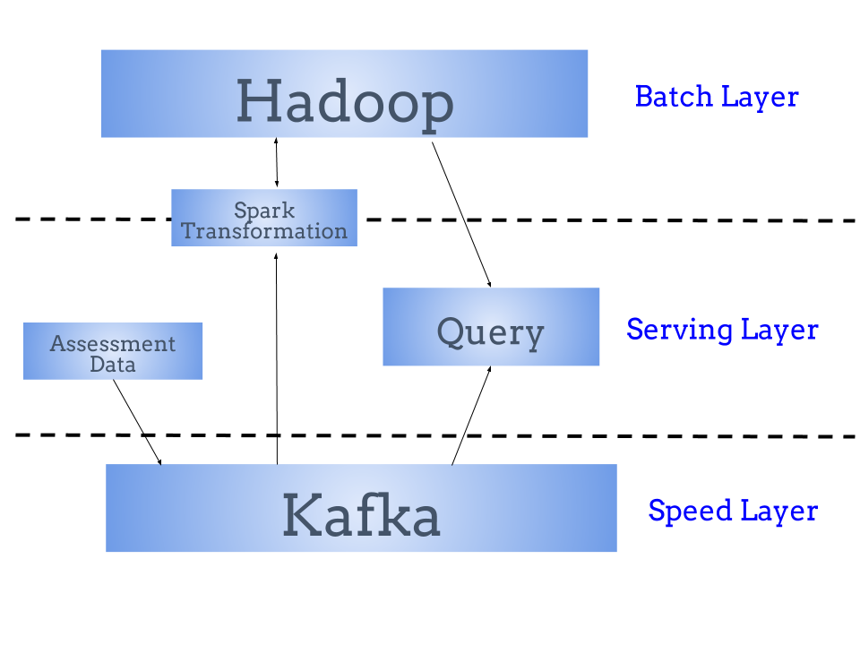
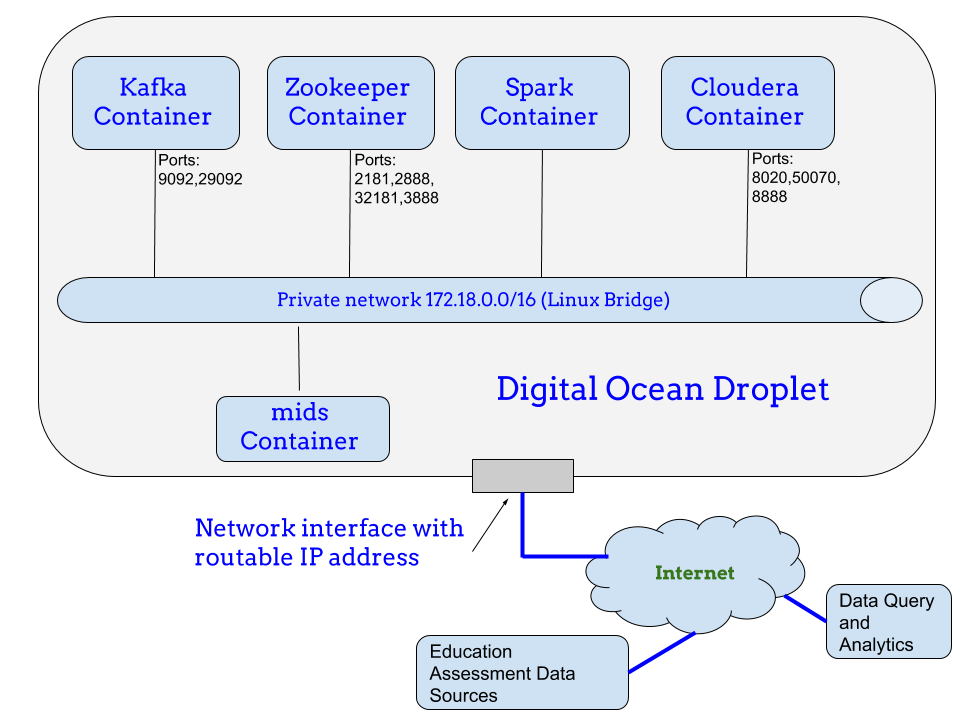

# Data Pipeline for Tracking User Activity

*By Guangyu (Gary) Pei*

## Executive summary

In example, a docker cluster (made of Kafka, Zookeeper, Spark, Cloudera and the mids containers)
is created to demonstrate how to publish/consume messages via Kafka, how to use Spark to transform the messages
and save as parquet files on Hadoop file system.

## Introduction

The scenario of this project is the following. Lots of different customers want to
publish their assessment data on our services. There is a need to provide data pipe line
for data scientists in the company who run queries on the data for those customers.

To meet the requirement, a Lambda Architecture (shown below) is used to address the data processing
needs. More specifically, Kafka is the speed layer to perform distributed data streaming.
Kafka needs to use Zookeeper for maintaining the leader/follower relationship, broker membership,
topic configuration and other management functionalities. Thus, Kafka and Zookeeper are working
together to provide the data pub/scribe services. For the batch layer, Hadoop is used. Spark
is also used to provide parallel data processing and additional message transformation
as needed before storing data into Hadoop file system.



The following figure shows how the above Lambda Architecture is implemented with Docker
container clusters in Digitial Ocean Droplet environment.

Both Kafka and Zookeeper containers are off the shelf containers. Also both mids and Spark containers are
customized/adapted by our teachers. All containers are connected via internal Linux bridge on
private network `172.18.0.0/16`.

Zookeeper listens on port number `32181`, which Kafka
uses to connect to Zookeeper. Kafka listens on port number `29092` for data streaming.
Cloudera countainer implements the Hadoop file system. Spark container runs Spark software,
which provides an interface for programming clusters with implicit data parallelism
and fault tolerance.
Kafka, Zookeeper and Cloudera containers can be reached by any other IP end point on the Internet
using the routable droplet IP address along with the port numbers shown in the figure.
Finally, the mids container is used to simulate the local data generation and consumption.



There are three files submitted for this assignment:

   - This file is the writeup with step-by-step command annotations.
   - [docker-compose.yml](docker-compose.yml) is the docker cluster configuration file.
   - [gary-pei-history.txt](gary-pei-history.txt) is the history raw file.

## Step by step illustrations

In the following section, I will illustrate the Kafka/Zookeeper/mids docker cluster creation and
the pub/scribe data streaming. In each step, the command number and the command are copied
from [gary-pei-history.txt](gary-pei-history.txt) file. For each command,
the corresponding stdout is also provided.

##### Step 1: I make directory w205/HW8 to hold data and docker-compose.yml file.
>1254  mkdir w205/HW8

>1255 cd w205/HW8

##### Step 2: I'm getting the data and output from console is shown below.
>1256 curl -L -o assessment-attempts-20180128-121051-nested.json https://goo.gl/f5bRm4

```console
science@w205s7-crook-13:~/w205/HW8$ curl -L -o assessment-attempts-20180128-121051-nested.json https://goo.gl/f5bRm4
  % Total    % Received % Xferd  Average Speed   Time    Time     Time  Current
                                 Dload  Upload   Total   Spent    Left  Speed
100   391    0   391    0     0   1888      0 --:--:-- --:--:-- --:--:--  1898
100 9096k  100 9096k    0     0   286k      0  0:00:31  0:00:31 --:--:--  263k
```
##### Step 3: I check the data file. It looks good since it is not empty.
>1257 ls -al

```console
science@w205s7-crook-13:~/w205/HW8$ ls -al
total 9108
drwxrwxr-x  2 science science    4096 Jun 30 17:16 .
drwxrwxr-x 31 science science    4096 Jun 30 17:15 ..
-rw-rw-r--  1 science science 9315053 Jun 30 17:16 assessment-attempts-20180128-121051-nested.json
```

##### Step 4: I copy the spark with kafka docker file used in session 8 and verify with cat. The output is shown below.
Note that the `docker-compose.yml` used in live session 8 is exact one we need for this assignment.

>1259 cp ~/w205/spark-with-kafka-and-hdfs/docker-compose.yml .

>1260 cat docker-compose.yml

```console
science@w205s7-crook-13:~/w205/HW8$ cat docker-compose.yml
---
version: '2'
services:
  zookeeper:
    image: confluentinc/cp-zookeeper:latest
    environment:
      ZOOKEEPER_CLIENT_PORT: 32181
      ZOOKEEPER_TICK_TIME: 2000
    expose:
      - "2181"
      - "2888"
      - "32181"
      - "3888"

  kafka:
    image: confluentinc/cp-kafka:latest
    depends_on:
      - zookeeper
    environment:
      KAFKA_BROKER_ID: 1
      KAFKA_ZOOKEEPER_CONNECT: zookeeper:32181
      KAFKA_ADVERTISED_LISTENERS: PLAINTEXT://kafka:29092
      KAFKA_OFFSETS_TOPIC_REPLICATION_FACTOR: 1
    expose:
      - "9092"
      - "29092"

  cloudera:
    image: midsw205/cdh-minimal:latest
    expose:
      - "8020" # nn
      - "50070" # nn http
      - "8888" # hue
    #ports:
    #- "8888:8888"

  spark:
    image: midsw205/spark-python:0.0.5
    stdin_open: true
    tty: true
    volumes:
      - /home/science/w205:/w205
    command: bash
    depends_on:
      - cloudera
    environment:
      HADOOP_NAMENODE: cloudera

  mids:
    image: midsw205/base:latest
    stdin_open: true
    tty: true
    volumes:
      - /home/science/w205:/w205
```

##### Step 5: I spin up the docker container cluster here. The docker cluster has zookeeper, kafka, spark and mids containers as indicated in the output below.
> 1261 docker-compose up -d

```console
science@w205s7-crook-13:~/w205/HW8$ docker-compose up -d
Creating network "hw8_default" with the default driver
Creating hw8_cloudera_1
Creating hw8_mids_1
Creating hw8_zookeeper_1
Creating hw8_kafka_1
Creating hw8_spark_1
```

##### Step 6: I double check the docker containers and they look good as shown below.
> docker-compose ps

```console
science@w205s7-crook-13:~/w205/HW8$ docker-compose ps
     Name                  Command            State                                         Ports                                        
----------------------------------------------------------------------------------------------------------------------------------------
hw8_cloudera_1    cdh_startup_script.sh       Up      11000/tcp, 11443/tcp, 19888/tcp, 50070/tcp, 8020/tcp, 8088/tcp, 8888/tcp, 9090/tcp 
hw8_kafka_1       /etc/confluent/docker/run   Up      29092/tcp, 9092/tcp                                                                
hw8_mids_1        /bin/bash                   Up      8888/tcp                                                                           
hw8_spark_1       docker-entrypoint.sh bash   Up                                                                                         
hw8_zookeeper_1   /etc/confluent/docker/run   Up      2181/tcp, 2888/tcp, 32181/tcp, 3888/tcp
```

##### Step 7: I monitor the Kafka log using `logs -f` in a seperate terminal.

```console
science@w205s7-crook-13:~/w205/HW8$ docker-compose logs -f kafka
...
kafka_1      | [2018-07-05 17:09:16,299] INFO Updated PartitionLeaderEpoch. New: {epoch:0, offset:0}, Current: {epoch:-1, offset:-1} for Partition: __confluent.support.metrics-0. Cache now contains 0 entries. (kafka.server.epoch.LeaderEpochFileCache)
kafka_1      | [2018-07-05 17:09:16,319] INFO [Producer clientId=producer-1] Closing the Kafka producer with timeoutMillis = 9223372036854775807 ms. (org.apache.kafka.clients.producer.KafkaProducer)
kafka_1      | [2018-07-05 17:09:16,323] INFO Successfully submitted metrics to Kafka topic __confluent.support.metrics (io.confluent.support.metrics.submitters.KafkaSubmitter)
kafka_1      | [2018-07-05 17:09:16,984] INFO Successfully submitted metrics to Confluent via secure endpoint (io.confluent.support.metrics.submitters.ConfluentSubmitter)
kafka_1      | [2018-07-05 17:14:10,804] TRACE [Controller id=1] Checking need to trigger auto leader balancing (kafka.controller.KafkaController)
kafka_1      | [2018-07-05 17:14:10,808] DEBUG [Controller id=1] Preferred replicas by broker Map(1 -> Map(__confluent.support.metrics-0 -> Vector(1))) (kafka.controller.KafkaController)
kafka_1      | [2018-07-05 17:14:10,813] DEBUG [Controller id=1] Topics not in preferred replica for broker 1 Map() (kafka.controller.KafkaController)
kafka_1      | [2018-07-05 17:14:10,813] TRACE [Controller id=1] Leader imbalance ratio for broker 1 is 0.0 (kafka.controller.KafkaController)
...
```

##### Step 8: I list the initial Hadoop file system.
> 1262 docker-compose exec cloudera hadoop fs -ls /tmp/

```console
science@w205s7-crook-13:~/w205/HW8$ docker-compose exec cloudera hadoop fs -ls /tmp/
Found 2 items
drwxrwxrwt   - mapred mapred              0 2018-02-06 18:27 /tmp/hadoop-yarn
drwx-wx-wx   - root   supergroup          0 2018-06-30 17:47 /tmp/hive
```

##### Step 9: I create a topic called "assessment-attempts".
>1266 docker-compose exec kafka kafka-topics --create --topic assessment-attempts --partitions 1 --replication-factor 1 --if-not-exists --zookeeper zookeeper:32181

```console
science@w205s7-crook-13:~/w205/HW8$ docker-compose exec kafka \
>   kafka-topics \
>     --create \
>     --topic assessment-attempts \
>     --partitions 1 \
>     --replication-factor 1 \
>     --if-not-exists \
>     --zookeeper zookeeper:32181
Created topic "assessment-attempts".
```
##### Step 10: I check the topic "assessment-attempts".
>1267 docker-compose exec kafka kafka-topics --describe --topic assessment-attempts --zookeeper zookeeper:32181

```console
science@w205s7-crook-13:~/w205/HW8$ docker-compose exec kafka kafka-topics --describe --topic assessment-attempts --zookeeper zookeeper:32181
Topic:assessment-attempts	PartitionCount:1	ReplicationFactor:1	Configs:
	Topic: assessment-attempts	Partition: 0	Leader: 1	Replicas: 1	Isr: 1
```
##### Step 11: I count the number of json entries in the file via mids container with command below.
>1268 docker-compose exec mids bash -c "cat /w205/HW8/assessment-attempts-20180128-121051-nested.json | jq '.[]' -c | wc -l "

```console
science@w205s7-crook-13:~/w205/HW8$ docker-compose exec mids bash -c "cat /w205/HW8/assessment-attempts-20180128-121051-nested.json | jq '.[]' -c | wc -l "
3280
```

The total number of json entries is `3280`.

##### Step 12: I publish messages to kafka.

As shown below, I use a bash shell in the mids container to run a microservice. The `cat` piped into `jq` and then
piped into the `kafkacat` utility with the -P option. The -P option tells it to publish messages. The -t options
gives it the topic name of "assessment-attempts". The kafka:29092 tells it the container name and the port number
 where kafka is running.

>1281 docker-compose exec mids bash -c "cat /w205/HW8/assessment-attempts-20180128-121051-nested.json | jq '.[]' -c | kafkacat -P -b kafka:29092 -t assessment-attempts && echo 'Produced 3280 messages to topic assessment-attempts.'"

```console
science@w205s7-crook-13:~/w205/HW8$ docker-compose exec mids bash -c "cat /w205/HW8/assessment-attempts-20180128-121051-nested.json | jq '.[]' -c | kafkacat -P -b kafka:29092 -t assessment-attempts && echo 'Produced 3280 messages to topic assessment-attempts.'"
Produced 3280 messages to topic assessment-attempts.
```

##### Step 13: I take a look at the json messages I just published.

Each messages are very long. So, I only show the output for the first message below.
I will use this to compare with I will get via `pyspark` in later steps.

>1282  docker-compose exec kafka    kafka-console-consumer      --bootstrap-server kafka:29092      --topic assessment-attempts      --from-beginning      --max-messages 1

```console
science@w205s7-crook-13:~/w205/HW8$ docker-compose exec kafka \
>    kafka-console-consumer \
>      --bootstrap-server kafka:29092 \
>      --topic assessment-attempts \
>      --from-beginning \
>      --max-messages 1

{"keen_timestamp":"1516717442.735266","max_attempts":"1.0","started_at":"2018-01-23T14:23:19.082Z","base_exam_id":"37f0a30a-7464-11e6-aa92-a8667f27e5dc","user_exam_id":"6d4089e4-bde5-4a22-b65f-18bce9ab79c8","sequences":{"questions":[{"user_incomplete":true,"user_correct":false,"options":[{"checked":true,"at":"2018-01-23T14:23:24.670Z","id":"49c574b4-5c82-4ffd-9bd1-c3358faf850d","submitted":1,"correct":true},{"checked":true,"at":"2018-01-23T14:23:25.914Z","id":"f2528210-35c3-4320-acf3-9056567ea19f","submitted":1,"correct":true},{"checked":false,"correct":true,"id":"d1bf026f-554f-4543-bdd2-54dcf105b826"}],"user_submitted":true,"id":"7a2ed6d3-f492-49b3-b8aa-d080a8aad986","user_result":"missed_some"},{"user_incomplete":false,"user_correct":false,"options":[{"checked":true,"at":"2018-01-23T14:23:30.116Z","id":"a35d0e80-8c49-415d-b8cb-c21a02627e2b","submitted":1},{"checked":false,"correct":true,"id":"bccd6e2e-2cef-4c72-8bfa-317db0ac48bb"},{"checked":true,"at":"2018-01-23T14:23:41.791Z","id":"7e0b639a-2ef8-4604-b7eb-5018bd81a91b","submitted":1,"correct":true}],"user_submitted":true,"id":"bbed4358-999d-4462-9596-bad5173a6ecb","user_result":"incorrect"},{"user_incomplete":false,"user_correct":true,"options":[{"checked":false,"at":"2018-01-23T14:23:52.510Z","id":"a9333679-de9d-41ff-bb3d-b239d6b95732"},{"checked":false,"id":"85795acc-b4b1-4510-bd6e-41648a3553c9"},{"checked":true,"at":"2018-01-23T14:23:54.223Z","id":"c185ecdb-48fb-4edb-ae4e-0204ac7a0909","submitted":1,"correct":true},{"checked":true,"at":"2018-01-23T14:23:53.862Z","id":"77a66c83-d001-45cd-9a5a-6bba8eb7389e","submitted":1,"correct":true}],"user_submitted":true,"id":"e6ad8644-96b1-4617-b37b-a263dded202c","user_result":"correct"},{"user_incomplete":false,"user_correct":true,"options":[{"checked":false,"id":"59b9fc4b-f239-4850-b1f9-912d1fd3ca13"},{"checked":false,"id":"2c29e8e8-d4a8-406e-9cdf-de28ec5890fe"},{"checked":false,"id":"62feee6e-9b76-4123-bd9e-c0b35126b1f1"},{"checked":true,"at":"2018-01-23T14:24:00.807Z","id":"7f13df9c-fcbe-4424-914f-2206f106765c","submitted":1,"correct":true}],"user_submitted":true,"id":"95194331-ac43-454e-83de-ea8913067055","user_result":"correct"}],"attempt":1,"id":"5b28a462-7a3b-42e0-b508-09f3906d1703","counts":{"incomplete":1,"submitted":4,"incorrect":1,"all_correct":false,"correct":2,"total":4,"unanswered":0}},"keen_created_at":"1516717442.735266","certification":"false","keen_id":"5a6745820eb8ab00016be1f1","exam_name":"Normal Forms and All That Jazz Master Class"}
Processed a total of 1 messages
```

##### Step 14: Use `spark` to consume messages published.

In the spark container, run the python `spark` command line utility called `pyspark` as shown below.

>1283 docker-compose exec spark pyspark

```console
science@w205s7-crook-13:~/w205/HW8$ docker-compose exec spark pyspark
Python 3.6.1 |Anaconda 4.4.0 (64-bit)| (default, May 11 2017, 13:09:58) 
[GCC 4.4.7 20120313 (Red Hat 4.4.7-1)] on linux
Type "help", "copyright", "credits" or "license" for more information.
Using Spark's default log4j profile: org/apache/spark/log4j-defaults.properties
Setting default log level to "WARN".
To adjust logging level use sc.setLogLevel(newLevel). For SparkR, use setLogLevel(newLevel).
18/06/30 18:04:06 WARN NativeCodeLoader: Unable to load native-hadoop library for your platform... using builtin-java classes where applicable
18/06/30 18:04:14 WARN ObjectStore: Version information not found in metastore. hive.metastore.schema.verification is not enabled so recording the schema version 1.2.0
18/06/30 18:04:14 WARN ObjectStore: Failed to get database default, returning NoSuchObjectException
18/06/30 18:04:15 WARN ObjectStore: Failed to get database global_temp, returning NoSuchObjectException
Welcome to
      ____              __
     / __/__  ___ _____/ /__
    _\ \/ _ \/ _ `/ __/  '_/
   /__ / .__/\_,_/_/ /_/\_\   version 2.2.0
      /_/

Using Python version 3.6.1 (default, May 11 2017 13:09:58)
SparkSession available as 'spark'.
>>>
```

##### Step 15: Enter python spark code to consume from the kafka topic "assessment-attempts".

Assessment json entries will be a `spark` data frame which is built on top of a `spark` RDD.
The following is the python code entered from the python interactive prompt.

```console
>>> raw_assessments = spark \
... .read \
... .format("kafka") \
... .option("kafka.bootstrap.servers", "kafka:29092") \
... .option("subscribe","assessment-attempts") \
... .option("startingOffsets", "earliest") \
... .option("endingOffsets", "latest") \
... .load()
>>>
```

##### Step 16: I use cache to supress warning messages which are distracting.

```console
>>> raw_assessments.cache()
DataFrame[key: binary, value: binary, topic: string, partition: int, offset: bigint, timestamp: timestamp, timestampType: int]
>>> 
```

##### Step 17: I check the schema of `raw_assessments`.

```console
>>> raw_assessments.printSchema()
root
 |-- key: binary (nullable = true)
 |-- value: binary (nullable = true)
 |-- topic: string (nullable = true)
 |-- partition: integer (nullable = true)
 |-- offset: long (nullable = true)
 |-- timestamp: timestamp (nullable = true)
 |-- timestampType: integer (nullable = true)

>>> 
```

##### Step 18: I translate the key and value into strings.

Since both key and value are binary, I use the following python code to translate them into strings so
we can read them. Create a new data frame which stores the assessments as strings. Because the data frames are
immutable, I cannot change them in place and I have to make a copy called `assessments`.
As displayed below, we can see "keen_timestamp" as we expected.

I also checked the total number of messages and it is `3280`, which matches what was published earlier.

```console
>>> assessments = raw_assessments.selectExpr("CAST(key AS STRING)", "CAST(value AS STRING)")
>>> assessments.show()
+----+--------------------+
| key|               value|
+----+--------------------+
|null|{"keen_timestamp"...|
|null|{"keen_timestamp"...|
|null|{"keen_timestamp"...|
|null|{"keen_timestamp"...|
|null|{"keen_timestamp"...|
|null|{"keen_timestamp"...|
|null|{"keen_timestamp"...|
|null|{"keen_timestamp"...|
|null|{"keen_timestamp"...|
|null|{"keen_timestamp"...|
|null|{"keen_timestamp"...|
|null|{"keen_timestamp"...|
|null|{"keen_timestamp"...|
|null|{"keen_timestamp"...|
|null|{"keen_timestamp"...|
|null|{"keen_timestamp"...|
|null|{"keen_timestamp"...|
|null|{"keen_timestamp"...|
|null|{"keen_timestamp"...|
|null|{"keen_timestamp"...|
+----+--------------------+
only showing top 20 rows

>>> assessments.printSchema()
root
 |-- key: string (nullable = true)
 |-- value: string (nullable = true)

>>> assessments.count()
3280
>>>
```

##### Step 19: I save the `assessment` data frame into a parquet file in hdfs.


```console
>>> assessments.write.parquet("/tmp/assessments")
>>> 
```

I used another command window to verify.

```console
science@w205s7-crook-13:~/w205/HW8$ docker-compose exec cloudera hadoop fs -ls /tmp/
Found 3 items
drwxr-xr-x   - root   supergroup          0 2018-06-30 18:31 /tmp/assessments
drwxrwxrwt   - mapred mapred              0 2018-02-06 18:27 /tmp/hadoop-yarn
drwx-wx-wx   - root   supergroup          0 2018-06-30 18:21 /tmp/hive
science@w205s7-crook-13:~/w205/HW8$ docker-compose exec cloudera hadoop fs -ls /tmp/assessments
Found 2 items
-rw-r--r--   1 root supergroup          0 2018-07-05 17:33 /tmp/assessments/_SUCCESS
-rw-r--r--   1 root supergroup    2513546 2018-07-05 17:33 /tmp/assessments/part-00000-973e5a4f-5165-4301-9d40-dbfcc43940c3-c000.snappy.parquet
```

##### Step 20: Extract the json fields, show first 5 rows and show schema.

Note that the example rows and schema show the nested json data.

```console
>>> from pyspark.sql import Row
>>> import json
>>> extracted_assessments = assessments.rdd.map(lambda x: Row(**json.loads(x.value))).toDF()
>>> extracted_assessments.show(5)
+--------------------+-------------+--------------------+------------------+--------------------+------------------+------------+--------------------+--------------------+--------------------+
|        base_exam_id|certification|           exam_name|   keen_created_at|             keen_id|    keen_timestamp|max_attempts|           sequences|          started_at|        user_exam_id|
+--------------------+-------------+--------------------+------------------+--------------------+------------------+------------+--------------------+--------------------+--------------------+
|37f0a30a-7464-11e...|        false|Normal Forms and ...| 1516717442.735266|5a6745820eb8ab000...| 1516717442.735266|         1.0|Map(questions -> ...|2018-01-23T14:23:...|6d4089e4-bde5-4a2...|
|37f0a30a-7464-11e...|        false|Normal Forms and ...| 1516717377.639827|5a674541ab6b0a000...| 1516717377.639827|         1.0|Map(questions -> ...|2018-01-23T14:21:...|2fec1534-b41f-441...|
|4beeac16-bb83-4d5...|        false|The Principles of...| 1516738973.653394|5a67999d3ed3e3000...| 1516738973.653394|         1.0|Map(questions -> ...|2018-01-23T20:22:...|8edbc8a8-4d26-429...|
|4beeac16-bb83-4d5...|        false|The Principles of...|1516738921.1137421|5a6799694fc7c7000...|1516738921.1137421|         1.0|Map(questions -> ...|2018-01-23T20:21:...|c0ee680e-8892-4e6...|
|6442707e-7488-11e...|        false|Introduction to B...| 1516737000.212122|5a6791e824fccd000...| 1516737000.212122|         1.0|Map(questions -> ...|2018-01-23T19:48:...|e4525b79-7904-405...|
+--------------------+-------------+--------------------+------------------+--------------------+------------------+------------+--------------------+--------------------+--------------------+
only showing top 5 rows

>>>>>> extracted_assessments.printSchema()
root
 |-- base_exam_id: string (nullable = true)
 |-- certification: string (nullable = true)
 |-- exam_name: string (nullable = true)
 |-- keen_created_at: string (nullable = true)
 |-- keen_id: string (nullable = true)
 |-- keen_timestamp: string (nullable = true)
 |-- max_attempts: string (nullable = true)
 |-- sequences: map (nullable = true)
 |    |-- key: string
 |    |-- value: array (valueContainsNull = true)
 |    |    |-- element: map (containsNull = true)
 |    |    |    |-- key: string
 |    |    |    |-- value: boolean (valueContainsNull = true)
 |-- started_at: string (nullable = true)
 |-- user_exam_id: string (nullable = true)

>>> 
```

##### Step 21: Cretae a spark temporary table called `assessments` based on the data frame.

`registerTempTable()` is a method of the spark class data frame.

```console
>>> extracted_assessments.registerTempTable('assessments')
>>>
```

##### Step 22: Issue spark sql against the temporary table `assessments`.

```console
>>> spark.sql("select exam_name, assessments.sequences.questions, max_attempts from assessments limit 10").show()
+--------------------+--------------------+------------+
|           exam_name|           questions|max_attempts|
+--------------------+--------------------+------------+
|Normal Forms and ...|[Map(user_incompl...|         1.0|
|Normal Forms and ...|[Map(user_incompl...|         1.0|
|The Principles of...|[Map(user_incompl...|         1.0|
|The Principles of...|[Map(user_incompl...|         1.0|
|Introduction to B...|[Map(user_incompl...|         1.0|
|        Learning Git|[Map(user_incompl...|         1.0|
|Git Fundamentals ...|[Map(user_incompl...|         1.0|
|Introduction to P...|[Map(user_incompl...|         1.0|
|Intermediate Pyth...|[Map(user_incompl...|         1.0|
|Introduction to P...|[Map(user_incompl...|         1.0|
+--------------------+--------------------+------------+

>>> spark.sql("select exam_name, user_exam_id, max_attempts from assessments limit 10").show()
+--------------------+--------------------+------------+
|           exam_name|        user_exam_id|max_attempts|
+--------------------+--------------------+------------+
|Normal Forms and ...|6d4089e4-bde5-4a2...|         1.0|
|Normal Forms and ...|2fec1534-b41f-441...|         1.0|
|The Principles of...|8edbc8a8-4d26-429...|         1.0|
|The Principles of...|c0ee680e-8892-4e6...|         1.0|
|Introduction to B...|e4525b79-7904-405...|         1.0|
|        Learning Git|3186dafa-7acf-47e...|         1.0|
|Git Fundamentals ...|48d88326-36a3-4cb...|         1.0|
|Introduction to P...|bb152d6b-cada-41e...|         1.0|
|Intermediate Pyth...|70073d6f-ced5-4d0...|         1.0|
|Introduction to P...|9eb6d4d6-fd1f-4f3...|         1.0|
+--------------------+--------------------+------------+

>>> 
```

##### Step 23: Save sql results to another parquet file in hdfs and check the hdfs.

```console
>>> some_assessments_info = spark.sql("select exam_name, assessments.sequences.questions, max_attempts from assessments limit 10")       
>>> some_assessments_info.write.parquet("/tmp/some_assessments_info")
>>>
```

Check the parquet file from another terminal window using the following commands.

```console
science@w205s7-crook-13:~/w205/HW8$ docker-compose exec cloudera hadoop fs -ls /tmp/
Found 4 items
drwxr-xr-x   - root   supergroup          0 2018-06-30 18:31 /tmp/assessments
drwxrwxrwt   - mapred mapred              0 2018-02-06 18:27 /tmp/hadoop-yarn
drwx-wx-wx   - root   supergroup          0 2018-06-30 18:21 /tmp/hive
drwxr-xr-x   - root   supergroup          0 2018-06-30 19:16 /tmp/some_assessments_info
```

```console
science@w205s7-crook-13:~/w205/HW8$ docker-compose exec cloudera hadoop fs -ls /tmp/assessments
Found 2 items
-rw-r--r--   1 root supergroup          0 2018-07-05 17:33 /tmp/assessments/_SUCCESS
-rw-r--r--   1 root supergroup    2513546 2018-07-05 17:33 /tmp/assessments/part-00000-973e5a4f-5165-4301-9d40-dbfcc43940c3-c000.snappy.parquet
```

```console
science@w205s7-crook-13:~/w205/HW8$ docker-compose exec cloudera hadoop fs -ls /tmp/some_assessments_info
Found 2 items
-rw-r--r--   1 root supergroup          0 2018-07-05 17:38 /tmp/some_assessments_info/_SUCCESS
-rw-r--r--   1 root supergroup       1710 2018-07-05 17:38 /tmp/some_assessments_info/part-00000-49d94cae-ccba-4501-9278-2f4ea525c3c1-c000.snappy.parquet
```

##### Step 24: Get `questions` field from the data and save to parquet file (extra example for nested JSON).
In the following, I use the example from our instructor to perform additional processing for the `questions` field
in the JSON.

```console
>>> def lambda_for_questions(x):
...    raw_dict = json.loads(x.value)
...    my_list = []
...    my_count = 0
...    for l in raw_dict["sequences"]["questions"]:
...        my_count += 1
...        my_dict = {"keen_id" : raw_dict["keen_id"], "my_count" : my_count, "id" : l["id"]}
...        my_list.append(my_dict)
...    return my_list
...
>>> questions = assessments.rdd.flatMap(lambda_for_questions).toDF()
/spark-2.2.0-bin-hadoop2.6/python/pyspark/sql/session.py:351: UserWarning: Using RDD of dict to inferSchema is deprecated. Use pyspark.sql.Row instead
  warnings.warn("Using RDD of dict to inferSchema is deprecated. "
>>> questions.registerTempTable('questions')
>>> spark.sql("select id, my_count from questions limit 10").show()
+--------------------+--------+
|                  id|my_count|
+--------------------+--------+
|7a2ed6d3-f492-49b...|       1|
|bbed4358-999d-446...|       2|
|e6ad8644-96b1-461...|       3|
|95194331-ac43-454...|       4|
|95194331-ac43-454...|       1|
|bbed4358-999d-446...|       2|
|e6ad8644-96b1-461...|       3|
|7a2ed6d3-f492-49b...|       4|
|b9ff2e88-cf9d-4bd...|       1|
|bec23e7b-4870-49f...|       2|
+--------------------+--------+

>>> spark.sql("select q.keen_id, a.keen_timestamp, q.id from assessments a join questions q on a.keen_id = q.keen_id limit 10").show()
+--------------------+------------------+--------------------+
|             keen_id|    keen_timestamp|                  id|
+--------------------+------------------+--------------------+
|5a17a67efa1257000...|1511499390.3836269|803fc93f-7eb2-412...|
|5a17a67efa1257000...|1511499390.3836269|f3cb88cc-5b79-41b...|
|5a17a67efa1257000...|1511499390.3836269|32fe7d8d-6d89-4db...|
|5a17a67efa1257000...|1511499390.3836269|5c34cf19-8cfd-4f5...|
|5a26ee9cbf5ce1000...|1512500892.4166169|0603e6f4-c3f9-4c2...|
|5a26ee9cbf5ce1000...|1512500892.4166169|26a06b88-2758-45b...|
|5a26ee9cbf5ce1000...|1512500892.4166169|25b6effe-79b0-4c4...|
|5a26ee9cbf5ce1000...|1512500892.4166169|6de03a9b-2a78-46b...|
|5a26ee9cbf5ce1000...|1512500892.4166169|aaf39991-fa83-470...|
|5a26ee9cbf5ce1000...|1512500892.4166169|aab2e817-73dc-4ff...|
+--------------------+------------------+--------------------+

>>> questions.show(5)
+--------------------+--------------------+--------+
|                  id|             keen_id|my_count|
+--------------------+--------------------+--------+
|7a2ed6d3-f492-49b...|5a6745820eb8ab000...|       1|
|bbed4358-999d-446...|5a6745820eb8ab000...|       2|
|e6ad8644-96b1-461...|5a6745820eb8ab000...|       3|
|95194331-ac43-454...|5a6745820eb8ab000...|       4|
|95194331-ac43-454...|5a674541ab6b0a000...|       1|
+--------------------+--------------------+--------+
only showing top 5 rows

>>> questions.write.parquet("/tmp/questions")
```

Check the parquet file from another terminal window using the following commands.

```console
science@w205s7-crook-13:~/w205/HW8$ docker-compose exec cloudera hadoop fs -ls /tmp/
Found 5 items
drwxr-xr-x   - root   supergroup          0 2018-07-05 17:33 /tmp/assessments
drwxrwxrwt   - mapred mapred              0 2018-02-06 18:27 /tmp/hadoop-yarn
drwx-wx-wx   - root   supergroup          0 2018-07-05 17:09 /tmp/hive
drwxr-xr-x   - root   supergroup          0 2018-07-05 18:00 /tmp/questions
drwxr-xr-x   - root   supergroup          0 2018-07-05 17:38 /tmp/some_assessments_info
science@w205s7-crook-13:~/w205/HW8$ docker-compose exec cloudera hadoop fs -ls /tmp/questions
Found 2 items
-rw-r--r--   1 root supergroup          0 2018-07-05 18:00 /tmp/questions/_SUCCESS
-rw-r--r--   1 root supergroup     110973 2018-07-05 18:00 /tmp/questions/part-00000-405a98a8-f90b-44ec-8a40-b558d1b42f49-c000.snappy.parquet
```

##### Step 25: Exit Spark and Tear down the docker cluster.

At the pyspark command prompt type `exit()` followed by the following commands.
The outputs show that the docker cluster was
taken down gracefully.

>1284  docker-compose down

>1285  docker-compose ps

>1286  docker ps -a

>1287 history > ~/w205/assignment-08-gary-pei/gary-pei-history.txt

```console
>>>exit()
science@w205s7-crook-13:~/w205/HW8$ docker-compose down
Stopping hw8_kafka_1 ... done
Stopping hw8_spark_1 ... done
Stopping hw8_zookeeper_1 ... done
Stopping hw8_cloudera_1 ... done
Stopping hw8_mids_1 ... done
Removing hw8_kafka_1 ... done
Removing hw8_spark_1 ... done
Removing hw8_zookeeper_1 ... done
Removing hw8_cloudera_1 ... done
Removing hw8_mids_1 ... done
Removing network hw8_default
science@w205s7-crook-13:~/w205/HW8$ docker-compose ps
Name   Command   State   Ports 
------------------------------
science@w205s7-crook-13:~/w205/HW8$ docker ps -a
CONTAINER ID        IMAGE                  COMMAND             CREATED             STATUS              PORTS               NAMES
science@w205s7-crook-13:~/w205/HW8$ history > ~/w205/assignment-08-gary-pei/gary-pei-history.txt
```

## Summary

In this assignment, a docker cluster was created successfully. The data streaming functionality
was demonstrated via publishing and consuming messages using Kafka. The data used in demonstration
is a JSON file `assessment-attempts-20180128-121051-nested.json` downloaded from a provided URL.
Tested multiple subscribes and got the same data each time. I then demonstrated the use of Spark to
consume messages and transform messages as needed. Thus, these messages can be stored in
Hadoop file system for batch processing. In summary, the Docker cluster
meets all desired functionality for this assignment.
